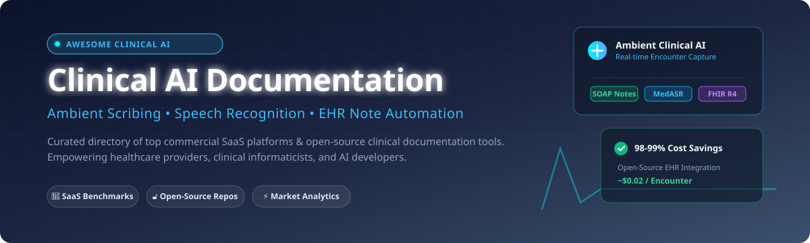

# 🏥 Awesome Clinical AI Documentation 🩺

  
  
  
  
  

---

## 📌 Overview & Scope

**Awesome Clinical AI Documentation** is a comprehensive, curated directory of **SaaS platforms**, **commercial tools**, and **open-source GitHub projects** driving innovation in **Ambient Clinical Scribing**, **Medical Speech Recognition (MedASR)**, and **Automated EHR Note Generation**.

These tools help physicians, nurses, and healthcare providers automate administrative workflows—capturing patient-clinician conversations in real-time, synthesizing structured SOAP/H&P notes, suggesting ICD-10/CPT codes, and pushing records straight to Electronic Health Record (EHR) systems like Epic, Cerner, and OpenEMR.

> **Key Focus Areas**: Ambient AI Scribes • Speech-to-Text (ASR) for Healthcare • Open-Source Clinical NLP • SMART on FHIR Integrations • Local-First HIPAA Compliant AI

---

## 📖 Table of Contents

- [📊 Market Dynamics & Industry Context](#-market-dynamics--industry-context)
- [☁️ SaaS & Hosted Commercial Platforms](#️-saas--hosted-commercial-platforms)
- [🔓 Open-Source GitHub Repositories](#-open-source-github-repositories)
- [🤝 How to Contribute](#-how-to-contribute)
- [💖 Support & Sponsorship](#-support--sponsorship)
- [⚠️ Compliance & Regulatory Disclaimer](#️-compliance--regulatory-disclaimer)
- [📈 Star History](#-star-history)

---

## 📊 Market Dynamics & Industry Context

The global **AI-powered clinical documentation market** is valued at **~$5.16B in 2026** and projected to reach **~$13.99B by 2030** at a **28.3% CAGR**. North America leads adoption with over **50% market share** due to high EHR penetration and provider burnout reduction mandates.

**Market Fragmentation**: The sector is **moderately fragmented**. Rather than a single winner-take-all monopoly, leadership is distributed across high-growth category specialists (e.g., Abridge, Ambience Healthcare, Suki AI, Nabla, DeepScribe) and tech giants (Microsoft DAX Copilot). Health systems frequently pilot multiple ambient scribing solutions across different specialties before standardizing enterprise-wide.

---

## ☁️ SaaS & Hosted Commercial Platforms

The table below lists top commercial SaaS platforms sorted by **Company Size (Revenue / Valuation)** in descending order.

| Platform | Description | Pricing (Starting Tier) | Free Tier / Trial Limits | Company Size (Valuation / Revenue) |
| :--- | :--- | :--- | :--- | :--- |
| **[Microsoft DAX Copilot](https://www.microsoft.com/en-us/health-solutions/clinical-workflow)** | Ambient clinical note generation seamlessly integrated into Epic and Microsoft Cloud for Healthcare. | **$369/provider/month** flat rate (+ ~$700/user setup fee) | **No free tier**; 30-day enterprise health system pilot upon sales request | **~$281B revenue** (Microsoft FY2025) |
| **[Abridge](https://www.abridge.com/)** | Generative AI for ambient documentation with deep EHR integration; partners with NVIDIA and Eli Lilly. | **$199/physician/month** starting tier | **No free tier**; customized 14-day enterprise trial for health system cohorts | **$5.3B valuation**, $117M ARR |
| **[Ambience Healthcare](https://www.ambiencehealthcare.com/)** | Comprehensive AI operating system for clinical notes, ICD-10 coding, and clinical trial matching. | **$150/provider/month** starting tier | **No free tier**; 14-day structured trial for medical groups | **$1.25B valuation**, ~$345M raised |
| **[Suki AI](https://suki.ai/)** | Voice-controlled AI assistant for SOAP note creation, ICD-10 code extraction, and EHR push. | **$99/user/month** (Essential tier) | **Free Forever Tier**: 3 notes/month for individual clinicians | **$317.8M valuation**, $26.5M revenue |
| **[Augmedix](https://www.augmedix.com/)** | Ambient documentation with options for fully automated AI or MDS human-in-the-loop validation. | **$149/user/month** (Augmedix Go) | **No free tier**; 30-day health system pilot program | **~$53.2M revenue** (Acquired by Commure) |
| **[Nabla](https://www.nabla.com/)** | Ambient AI assistant used by 130+ health orgs; incorporates LeCun world model technology via AMI. | **$119/clinician/month** (Pro tier) | **Free Forever Tier**: 30 encounters/month (No credit card required) | **$27.8M revenue**, $131M raised |
| **[DeepScribe](https://www.deepscribe.ai/)** | Ambient AI scribe trained on 5M+ clinical encounters for specialty-specific documentation. | **$175/provider/month** starting tier | **No free tier**; 14-day trial with 20 demo encounters | **$14.6M revenue**, 133+ employees |
| **[Freed AI](https://www.getfreed.ai/)** | Self-serve ambient AI scribe tailored for independent practice clinicians and telehealth. | **$39/month** (Starter tier: 40 notes/mo) | **7-Day Free Trial**: Unlimited notes on Premier tier with no credit card required | **~$19M ARR** (Private) |
| **[Sunoh.ai](https://www.sunoh.ai/)** | EHR-agnostic ambient medical scribe operating across mobile and desktop devices. | **$149/month** per provider starting tier | **14-Day Free Trial**: Up to 25 notes with sample clinical workflows | **Private** (Sunoh.ai) |
| **[Robin Healthcare](https://www.robinhealthcare.com/)** | Smart device (Robin Assistant) combining ambient AI capture with expert human coding review. | **$199/month** base hardware & AI package | **No free tier**; 30-day clinical evaluation trial | **$82M raised** |

---

## 🔓 Open-Source GitHub Repositories

Sorted by **GitHub Star Count** (descending). Star badges directly link to each repository's stargazers page.

| Repository | Description | Stars |
| :--- | :--- | :--- |
| **[MedASR (Google Health)](https://github.com/Google-Health/medasr)** | Conformer-based medical speech recognition model trained on **~5,000 hours** of physician dictation. Achieves **4.6% WER** on radiology dictation. |  |
| **[OpenScribe](https://github.com/sammargolis/OpenScribe)** | Local-first ambient AI scribe with AES-GCM encrypted browser storage, local Ollama/MedGemma integration, and Whisper transcription. |  |
| **[DocuScribe AI](https://github.com/abh2050/docu_scribe_ai)** | Multi-agent clinical documentation pipeline generating SOAP notes, UMLS concepts, ICD-10 recommendations, and **FHIR R4** JSON exports. |  |
| **[clinical-note-generator](https://github.com/kennedyraju55/clinical-note-generator)** | Privacy-focused clinical note generator running **Gemma 3 via local Ollama**. Built with FastAPI & Streamlit for 100% offline note synthesis. |  |
| **[FLWhisper](https://github.com/leestott/FLWhisper)** | Local medical transcription service utilizing **Microsoft AI Foundry Local + Whisper Medium**. Provides OpenAI-compatible REST API endpoints. |  |
| **[AI-Enhanced OpenEMR](https://github.com/iupui-soic/openemr-ai)** | Reference ambient scribe integrated into OpenEMR via SMART on FHIR. Operates at **~$0.02 per encounter** (98-99% cost reduction vs commercial SaaS). |  |
| **[Whisper-Medical-Transcription](https://github.com/charlie-haley/whisper-medical-transcription)** | Open-source finetuned Whisper model specialized for clinical terminology, anatomy, and pharmacology voice dictation. |  |
| **[SOAP-Note-AI-Scribe](https://github.com/mitch-b/soap-note-ai-scribe)** | Lightweight Python app converting clinical audio to structured SOAP notes using Whisper ASR and Llama-3-70B. |  |

---

## 🤝 How to Contribute

We welcome community contributions! To add a new platform or open-source tool:

1. **Fork** the repository.
2. Add your tool to `README.md` in alphabetical or star-sorted order within the relevant section.
3. Ensure descriptions are **factual**, note explicit pricing/limits, and include official links.
4. Submit a **Pull Request** with a brief summary of the project.

---

## 💖 Support & Sponsorship

Thank you for exploring and supporting **Awesome Clinical AI Documentation**! 🌟

If this repository has helped your clinical practice, research group, or healthcare engineering project, please consider:
- ⭐️ **Starring** this repository to increase visibility.
- 🔀 **Forking** and sharing with colleagues and medical informaticists.
- ☕ **Sponsoring the project** to keep clinical AI research resources open and updated:

---

## ⚠️ Compliance & Regulatory Disclaimer

- This list is **community-curated** for informational and research purposes only.
- Software processing **Protected Health Information (PHI)** must comply with **HIPAA**, **GDPR**, and regional healthcare data security standards.
- Commercial implementations require executing a **Business Associate Agreement (BAA)**. Open-source deployments require institutional security reviews and local HIPAA safeguards.

---

## 📈 Star History

